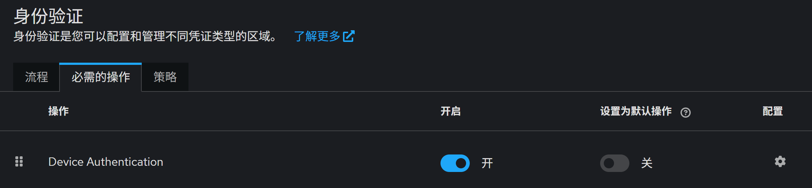
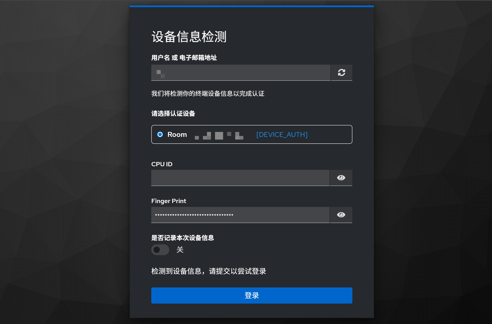

# Keycloak Device Auth

基于Keycloak，提供对终端设备信息认证功能的支持

当前供Keycloak认证的信息包括：

- 终端设备的CPUID
- 终端设备浏览器指纹`FingerPrint`

> [!IMportant]
>
> 由于侵入式设备信息提取程序（Agent程序）使用WiX打包，所以此插件仅在**终端设备系统**为Windows的运行环境中进行过测试（Keycloak后端可运行于Linux），Linux终端设备能否运行尚未测试

## 特点

- 设限：最多允许3台不同设备注册

- 安全：敏感认证信息被签名后传递（除注册新设备时），明文信息不泄露、防重放、防伪造

- 扩展：插件本身提供初次设备注册业务，另提供自定义Condition用于判断是否勾选【注册新设备】

> [!TIP]
>
> Condition用于支持多设备注册业务，该业务可参照[隐私问题认证](https://github.com/FnICeN/keycloak-plugin)样例进行开发

# 部署

为了运行插件，需要下载或构建3个JAR包和1个exe安装程序：

1. DeviceAuth.jar
2. DeviceAuthApi.jar
3. DeviceAuthProviderImpl.jar
4. GetInfo.exe

## 快速开始

1. 从[Release](https://github.com/FnICeN/Device-Auth/releases)获取最新JAR包与安装程序

2. 双击GetInfo.exe，Agent程序将会在命令行启动

3. 将三个JAR包放入Keycloak的`providers/`目录中

   - 如果Keycloak是一般部署方式，则路径为`keycloak/providers/`
   - 如果Keycloak使用Docker部署，则路径为`/opt/jboss/keycloak/standalone/deployments/`

4. 执行`bin/kc.sh build`并运行Keycloak

5. 以admin登录Keycloak管理后台，边栏选择【身份验证】——【必需的操作】

6. 找到Device Authentication，点击右侧开关开启

   

7. 选择【流程】，在某个流程中添加执行器，选择Device Auth，将之添加到Username Password Form之后

用户登录时，输入账户密码后，即进入设备认证环节：



## 手动构建

> [!NOTE]
>
> [Release](https://github.com/FnICeN/Device-Auth/releases)中的JAR包使用JDK23构建，如果你想更改JDK版本（一些旧版本Keycloak不兼容较新的JDK），可以修改存在的4个`pom.xml`并手动构建，环境需求：
>
> - Maven
> - JDK
> - WiX（构建Java版本Agent）
> - Go（构建Go版本Agent）

克隆项目：

```bash
git clone git@github.com:FnICeN/Device-Auth.git
```

### JAR包

分别在以下三个目录执行`mvn clean package`：

- `DeviceAuth/`
- `DeviceAuth/modules/DeviceAuthApi/`
- `DeviceAuth/modules/DeviceAuthProviderImpl/`

相应的，各目录下都会出现`target/xxx.jar`文件，收集起来得到3个JAR包

### Agent程序（Go版本）

> [!NOTE]
>
> 本项目的Agent程序存在两个版本，实现的功能一致，Go版本是后来新编写的，程序健壮性和运行时体积优于Java版本，开发者可以在这两者中二选一进行构建

1. 安装Go环境

2. 安装依赖：

   ```bash
   cd DeviceAuth/modules/GetInfo-go
   go mod tidy
   ```

3. 构建：

   ```bash
   go build
   ```

   得到GetInfo.exe，双击运行

接下来的部署步骤从[上文](#快速开始)第3步开始即可

### Agent程序（Java版本）

1. 安装WiX

2. 打包为JAR文件：

   ```bash
   cd DeviceAuth/modules/GetInfo
   mvn clean package
   ```

   得到`GetDeviceInfo-1.0-SNAPSHOT-shaded.jar`

3. 构建Windows安装程序：

   ```bash
   jpackage --input target/ --name LocalHWService --main-jar GetDeviceInfo-1.0-SNAPSHOT-shaded.jar --main-class org.example.LocalHardwareService --type exe --vendor "<NAME>" --description "<DESCRIBE>"
   ```

如此即可生成`LocalHWService-1.0.exe`文件

> [!TIP]
>
> 有关构建Agent安装程序的详细说明见[此博客](https://blog.fnicen.top/posts/%E5%B0%86java%E9%A1%B9%E7%9B%AE%E6%89%93%E5%8C%85%E4%B8%BA%E5%8F%AF%E6%89%A7%E8%A1%8C%E6%96%87%E4%BB%B6/)

在**终端设备**运行`LocalHWService.exe`安装程序，本地Agent将被默认安装于`C:/Program Files/LocalHWService/`目录下，双击exe文件，Agent程序即开始在后台运行

接下来的部署步骤从[上文](#快速开始)第3步开始即可